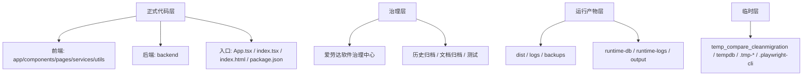

# 当前版本真实结构总图-当前版

> 2026-04-28 修正：当前真实结构总图以 `结构目录与运行链_2026-04-28.md` 为准。
>
> 当前稳定运行链已经收束为 `F:\爱牢达` 源码 -> `AilaoDa_Stable_Package` -> `E:\爱劳达纯净系统` -> `http://127.0.0.1:5001/` -> `D:\AilaoDaRuntime\stable.db`。阶段 3 看板结论为 `ready-for-local-soak`。

## 2026-04-28 当前真实总图

```text
F:\爱牢达
├── app/                         # React 全局上下文
├── components/                  # 公共组件、导航、UI 底座
├── pages/                       # 业务页面和页面级子模块
│   ├── barter/                  # 货抵页面常量、小组件、预览函数
│   ├── production/              # 生产 BOM、工单、批次追踪
│   ├── procurement/             # 采购、供应商、收货
│   ├── warehouse/               # 仓储库存、流水、调拨
│   ├── sales-orders/            # 销售订单草稿、动作、回款
│   └── crm/                     # 客户主数据、地址、联系人
├── services/                    # 前端 API 客户端
├── utils/                       # 前端工具和数据映射
├── translations/                # 中英越三语包
├── backend/                     # Express + Prisma + SQLite 后端
├── scripts/                     # 启动、打包、验收、Phase 3 闸门
│   └── lib/                     # 审计共享工具和进程守卫
├── dist/                        # 前端构建产物
├── AilaoDa_Stable_Package/      # F 盘稳定包产物
├── output/                      # 审计报告和截图
└── 爱劳达软件治理中心/          # 治理台账和当前结构证据
```

---

> 2026-04-23 修正：当前真实结构总图以 `结构目录与运行链_2026-04-23.md` 为准。
>
> 本文件下方旧正文保留历史语境，但其中 `src/`、`runtime-db`、部分 `.tmp-*` 临时文件口径已经不是当前运行链事实。当前稳定入口、稳定数据库、审计链、Phase 3 包装器和分层边界请优先阅读 `结构目录与运行链_2026-04-23.md`。

## 2026-04-23 当前真实总图

```text
F:\爱牢达
├── app/                         # React 全局上下文
├── components/                  # 前端公共组件和 UI 底座
├── pages/                       # 业务页面和页面级子模块
├── services/                    # 前端 API 客户端
├── utils/                       # 前端工具
├── translations/                # 中英越三语包
├── backend/                     # Express + Prisma + SQLite 后端
│   ├── src/                     # 后端源码
│   └── prisma/
│       ├── schema.prisma        # Prisma 入口壳
│       └── models/              # 分域 Prisma 模型
├── scripts/                     # 启动、审计、验收、Phase 3 闸门
├── dist/                        # 前端构建产物
├── backups/                     # 本地备份，不随意删除
├── logs/                        # 运行日志
├── output/                      # 审计报告和截图
├── uploads/                     # 上传附件
├── AilaoDa_Stable_Package*/     # 稳定包/历史稳定包
├── 历史归档/                    # 历史对照和旧版本
└── 爱劳达软件治理中心/          # 治理台账和当前结构证据
```

当前运行链：

```text
npm run verify:phase3:package-browser
  -> scripts/verify-phase3-package-browser.ps1
  -> AilaoDa_Stable_Package/scripts/start-stable-v2.ps1
  -> AilaoDa_Stable_Package/backend/dist/server.js
  -> http://127.0.0.1:5001/
  -> D:\AilaoDaRuntime\stable.db
```

---

## 历史正文

## 目的

这份文档只回答 3 个问题：

1. 当前版本的正式代码到底在哪里
2. 当前版本的运行产物和临时目录到底在哪里
3. 后续修复时，哪些目录可以继续用，哪些目录不能再被当成正式版本

## 一、正式代码层

以下目录应视为当前 ERP+CRM 正式代码层：

- `F:\爱牢达\app`
- `F:\爱牢达\backend`
- `F:\爱牢达\components`
- `F:\爱牢达\pages`
- `F:\爱牢达\services`
- `F:\爱牢达\src`
- `F:\爱牢达\translations`
- `F:\爱牢达\utils`
- `F:\爱牢达\App.tsx`
- `F:\爱牢达\index.tsx`
- `F:\爱牢达\index.html`
- `F:\爱牢达\package.json`
- `F:\爱牢达\vite.config.ts`
- `F:\爱牢达\types.ts`
- `F:\爱牢达\constants.tsx`

这些文件和目录共同构成当前前后端业务本体。

## 二、治理与说明层

以下目录是治理层，不属于运行时代码，但属于正式版本的重要组成部分：

- `F:\爱牢达\爱劳达软件治理中心`
- `F:\爱牢达\文档归档`
- `F:\爱牢达\历史归档`
- `F:\爱牢达\测试`

治理层的作用是：

- 保存当前版定义
- 记录历史版本对照
- 记录主线包、扩展层、风险与修复顺序

## 三、运行产物层

以下目录属于运行产物层，不应再被误认为正式源码：

- `F:\爱牢达\dist`
- `F:\爱牢达\logs`
- `F:\爱牢达\backups`
- `F:\爱牢达\output`
- `F:\爱牢达\runtime-db`
- `F:\爱牢达\runtime-logs`

说明：

- `dist` 是前端构建产物
- `logs`、`runtime-logs` 是日志层
- `backups` 是备份层
- `runtime-db` 当前只应作为候选运行数据库目录，不应和业务源码混读

## 四、临时/比对/探测层

以下目录或文件属于临时层，不应作为正式运行链的一部分：

- `F:\爱牢达\.playwright-cli`
- `F:\爱牢达\tempdb`
- `F:\爱牢达\temp_compare_cleanmigration`
- `F:\爱牢达\.tmp-customer-direct.cjs`
- `F:\爱牢达\.tmp-customer-smoke.cjs`
- `F:\爱牢达\.tmp-order-read.cjs`
- `F:\爱牢达\.tmp-order-read.js`
- `F:\爱牢达\.tmp-order-smoke.cjs`
- `F:\爱牢达\.tmp-order-smoke.js`
- `F:\爱牢达\tmp-playwright-eval.js`
- `F:\爱牢达\write-test.txt`

这些内容的定位是：

- 临时测试
- 历史对照
- 运行探测
- 问题复现

后续修复完成后，应统一清理或归档。

## 五、当前版本的真实分层



## 六、当前结构的主要问题

当前版本最大的结构问题不是“目录太多”，而是“层次未被严格执行”：

1. 正式代码层、运行产物层、临时层同时出现在根目录
2. 部分运行链已经从项目内目录漂移到外部或临时目录
3. 临时探测文件尚未集中归档，容易干扰后续判断

## 七、当前版结构规则

从本文件生效后，统一采用以下规则：

1. 只把“正式代码层”当作系统本体
2. 运行产物层不再被视为源码
3. 临时层不再参与正式运行判断
4. 后续修复前，必须先说明改动属于哪一层

## 八、后续结构收口顺序

1. 先定义唯一运行链
2. 再定义唯一数据库路径
3. 最后再清理临时层和冗余入口
