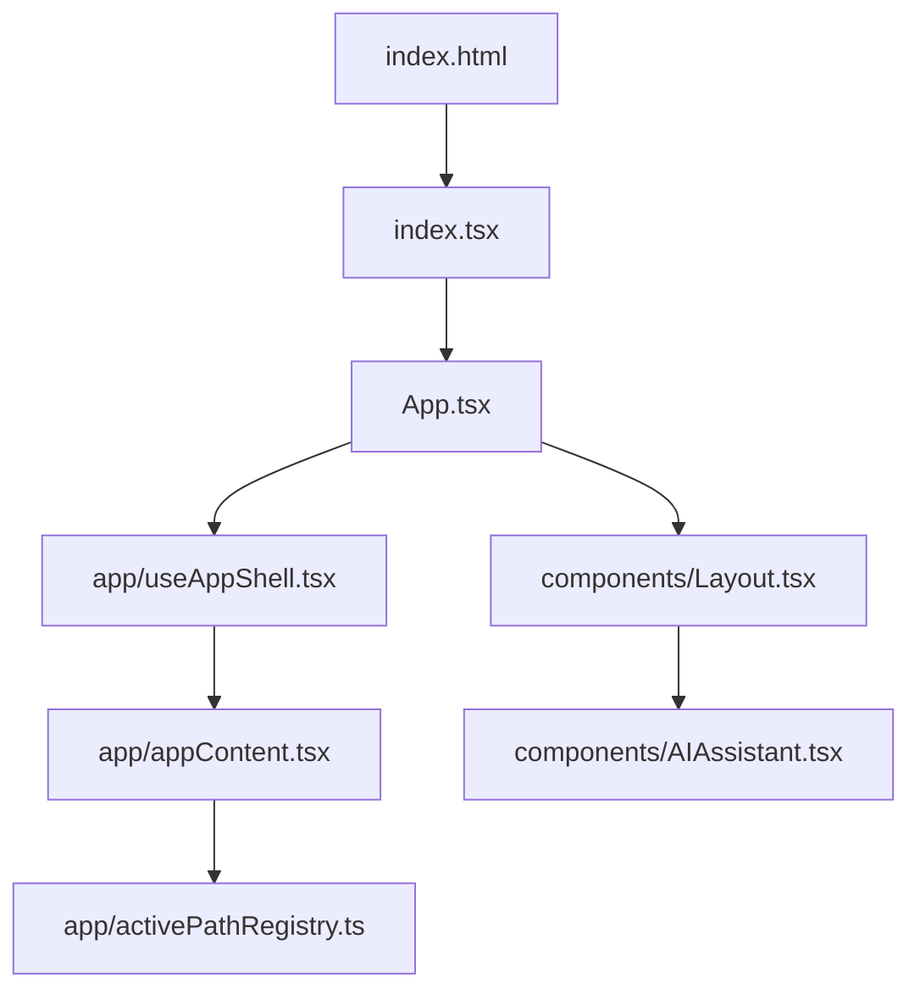
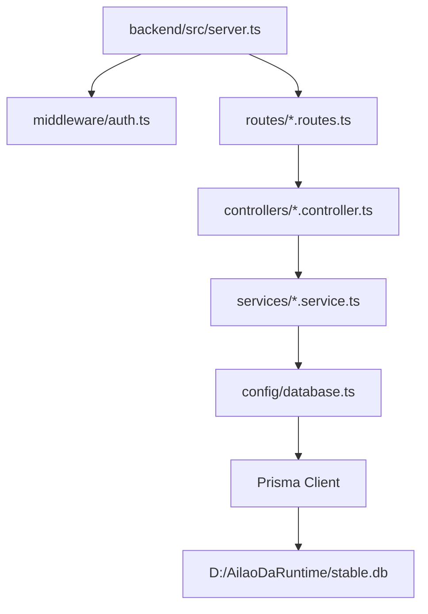

# 结构目录与运行链（2026-04-18）

## 结论

当前项目是一个本地可运行、后续可迁移服务器的 React + Vite 前端、Express + Prisma 后端、SQLite 运行库的 ERP+CRM 系统。后续修复必须先确认文件属于哪一层，不能把历史归档、运行产物、审计输出或别的项目进程误当成当前有效源码。

当前稳定入口：

- 运行地址：`http://127.0.0.1:5001`
- 后端进程：`node backend/dist/server.js`
- 运行数据库：`D:\AilaoDaRuntime\stable.db`
- 前端产物：`F:\爱牢达\dist`
- 备份目录：`F:\爱牢达\backups`

当前同机还存在 `F:\智仔` 的 Vite 进程，占用 `5173` 一类开发端口。爱劳达验收和用户打开页面时，应优先以 `http://127.0.0.1:5001` 为准，避免误进智仔页面。

## 一、根目录分层

### 1. 正式源码层

这些目录和文件才是当前爱劳达系统的主要修改对象：

- `App.tsx`：React 应用壳，登录后挂载 `Layout` 和当前页面。
- `index.tsx`：React 根入口。
- `index.css`：全局样式与 UI token。
- `app/`：应用状态、上下文、当前页面渲染注册。
- `components/`：公共组件、布局、AI 助手、登录、表格、命令面板。
- `pages/`：业务页面和页面内子模块。
- `services/`：前端 API 调用封装和本地 AI/导入规则。
- `utils/`：前端工具、客户名/地址/权限/适配器。
- `translations/`：中英越三语字典。
- `backend/src/`：后端正式源码。
- `backend/prisma/schema.prisma`：Prisma 数据模型。
- `types.ts`：前端全局类型。
- `constants.tsx`：前端全局常量。
- `package.json`、`backend/package.json`：脚本和依赖入口。

### 2. 治理文档层

这些目录是项目治理资料，不参与运行，但必须保留：

- `爱劳达软件治理中心/`
- `历史归档/`
- `文档归档/`
- `测试/`
- `.agents/`

### 3. 运行产物层

这些是运行结果或构建结果，不应作为源码修改：

- `dist/`
- `backend/dist/`
- `logs/`
- `output/`
- `backups/`
- `uploads/`
- `node_modules/`

### 4. 浏览器/审计临时层

这些目录主要服务浏览器审计和环境探测：

- `.playwright/`
- `.playwright-cli/`
- `.playwright-daemon/`
- `output/browser-cdp-profile/`

规则：浏览器审计可以使用这些目录，但不能把里面的截图、报告、缓存当成源码乱码或业务代码问题。

## 二、前端运行链

关键说明：

- `App.tsx` 显式导入 `app/useAppShell.tsx`，避免解析到旧 `.ts` 文件。
- `activePathRegistry.ts` 是当前页面是否真正挂载的准入口。
- `Layout.tsx` 决定左侧菜单、角色可见性、语言、币种、AI 入口。
- `services/api.ts` 是前端请求后端的主要通道。

## 三、当前实际挂载页面

当前 `app/activePathRegistry.ts` 挂载 20 个页面：

| 路由 ID | 页面文件 | 业务含义 |
|---|---|---|
| `dashboard` | `pages/Dashboard.tsx` | 工作台 |
| `crm` | `pages/CRM.tsx` | 客户关系与信用档案 |
| `risk` | `pages/RiskControl.tsx` | 风控 |
| `shipping` | `pages/Shipping.tsx` | 发货物流 |
| `rma` | `pages/RMA.tsx` | 售后 |
| `samples` | `pages/Samples.tsx` | 样品 |
| `orders` | `pages/SalesOrders.tsx` | 销售订单 |
| `team` | `pages/TeamManagement.tsx` | 团队 |
| `audit` | `pages/AuditLogs.tsx` | 审计日志 |
| `assets` | `pages/Assets.tsx` | 资产 |
| `production` | `pages/ProductionWorkspace.tsx` | 生产 |
| `dealerAnalytics` | `pages/DealerAnalytics.tsx` | 经销商分析 |
| `procurement` | `pages/Procurement.tsx` | 采购 |
| `barter` | `pages/BarterWorkspace.clean.tsx` | 货抵支付 / 换货贸易 |
| `contracts` | `pages/Contracts.tsx` | 合同 |
| `financeAnalytics` | `pages/FinanceAnalyticsWorkspaceV2.tsx` | 财务经营 |
| `adjustment` | `pages/adjustment/AdjustmentCenterView.tsx` | 调整中心 |
| `collections` | `pages/collections/CollectionCenterView.tsx` | 回款中心 |
| `warehouse` | `pages/WarehouseWorkspace.tsx` | 仓储 |
| `discrepancies` | `pages/ReceiptDiscrepancyWorkbench.tsx` | 收发货差异 |

规则：后续判断“页面是否有效”，先看是否在 `activePathRegistry.ts` 挂载，不再凭文件名猜。

## 四、页面内子模块

这些不是独立路由，但属于当前页面的重要组成：

- `pages/crm/`：CRM 建档、详情抽屉、客户池审计、列配置、hook。
- `pages/sales-orders/`：订单头表单、明细行网格、付款弹窗、历史弹窗、订单 hook。
- `pages/shipping/`：物流面板、资产面板、OCR 面板、发货 hook。
- `pages/collections/`：回款中心视图、行动弹窗、订单详情、回款 hook。
- `pages/adjustment/`：调整中心视图、详情、表单、表格、常量和帮助函数。
- `pages/production/`：BOM 明细网格、完工弹窗。
- `pages/finance/`：现金流和台账面板。

规则：这些文件不能简单标记为“未挂载页面”，它们被业务页面引用，属于有效子模块。

## 五、后端运行链

后端挂载入口：

- `/api/auth`
- `/api/customers`
- `/api/orders`
- `/api/samples`
- `/api/shipping`
- `/api/rma`
- `/api/team`
- `/api/dashboard`
- `/api/assets`
- `/api/audit`
- `/api/procurement`
- `/api/collections`
- `/api/adjustments`
- `/api/system`
- `/api/barter`
- `/api/timber`：旧木材专用接口，已断开为 `410 Gone`，返回 `LEGACY_TIMBER_API_DISABLED`，替代入口为 `/api/barter`
- `/api/contracts`
- `/api/production`
- `/api/finance`
- `/api/currency`
- `/api/warehouses`
- `/api/receipt-discrepancies`

当前后端路由总数约 149 个，其中 `GET`、`POST`、`PATCH`、`PUT`、`DELETE` 混合存在。权限修复必须同时看：

- 路由层 `authenticate` / `authorize`
- 控制器层 record-level scope
- 服务层状态机与金额/库存/客户关联
- API 审计脚本是否覆盖读回

## 六、数据库结构

当前 Prisma schema 有 40 个模型，运行库审计有 43 张表。主要业务模型包括：

- 主数据：`User`、`Customer`、`Supplier`
- 销售：`Order`、`OrderItem`
- 采购：`PurchaseOrder`
- 样品与物流：`Sample`、`Shipment`、`Rma`
- 收发货差异：`ReceiptDiscrepancyCase`、`ReceiptDiscrepancyAction`、`ReceiptToleranceRule`
- 生产：`ProductionBom`、`ProductionBomItem`、`ProductionWorkOrder`、`ProductionProcessStep`、`ProductionQualityCheck`
- 仓储：`Warehouse`、`Location`、`StockBalance`、`StockEntry`、`StockMovement`
- 财务/资产：`PaymentRecord`、`AssetBalance`、`AssetTransaction`、`InventoryCostLedger`
- 货抵/换货：`BarterAgreement`、`BarterAgreementItem`、`BarterSettlement`、`BarterItem`、`BarterValuationSnapshot`、`BarterOffsetPosting`、`BarterReversalLog`
- 合同/回款：`Contract`、`ContractMilestone`、`CollectionPromise`、`CollectionDispute`
- 审计：`AuditLog`
- 调整：`AdjustmentRecord`

重要规则：

- `backend/prisma/*.db` 和 `backend/prisma/tenants/*.db` 是历史/开发残留或候选库，不是当前运行库。
- 当前运行库只认 `D:\AilaoDaRuntime\stable.db`。
- 后续迁移服务器时，优先以 Prisma schema + runtime backup + db audit 三件套为准。

## 七、审计与脚本层

`scripts/` 当前约 70 个脚本，主要分为：

- 启停/运行检查：`start-stable-v2.ps1`、`check-runtime.ps1`
- 浏览器审计：`cdp-core-pages-smoke-audit-v1.cjs`、`crm-ai-assistant-browser-audit-v1.cjs`
- API 链路审计：`crm-permission-ai-audit-v1.cjs`、`orders-api-audit-v1.cjs`、`procurement-api-audit-v1.cjs`
- 并发/一致性审计：`concurrency-consistency-audit-v1.cjs`
- 备份恢复审计：`backup-restore-api-audit-v1.cjs`
- 隔离旧脚本：`scripts/quarantine/`

规则：

- 新增审计脚本必须自带超时、报告路径、退出逻辑。
- CDP 浏览器审计必须关闭临时 page/context，不能留下孤儿 Node 进程。
- 报告 JSON 不能被当成源码乱码证据。

## 八、大文件拆分候选

当前最值得后续拆分的文件：

| 文件 | 行数 | 建议 |
|---|---:|---|
| `backend/src/controllers/customer.controller.ts` | 1700 | 拆为 query、mutation、pool、assets、io |
| `backend/src/services/barter.service.ts` | 1254 | 拆为 agreement、valuation、settlement、posting |
| `pages/ProductionWorkspaceV2.tsx` | 1114 | 若继续使用，拆为 workbench、BOM、work-order、quality |
| `utils/mockAdapter.ts` | 1087 | 降级为隔离 fallback，不应参与真实业务判断 |
| `backend/src/controllers/procurement.controller.ts` | 1001 | 拆为 supplier、purchase-order、receipt、stock-posting |
| `backend/src/services/receipt-discrepancy.service.ts` | 993 | 拆为 query、rule、action、posting |
| `pages/sales-orders/useSalesOrders.ts` | 934 | 拆为 load、mutation、payment、export、ui-state |
| `backend/src/validators/index.ts` | 926 | 按模块拆 validator |
| `pages/Procurement.tsx` | 905 | 拆供应商列表、采购单、入库、右侧表单 |
| `backend/src/controllers/shipping.controller.ts` | 886 | 拆 shipment、receipt、asset、ocr |

拆分原则：不为了好看拆。只有当文件同时承担“查询 + 写入 + 状态机 + 导入导出 + UI 状态”时才拆。

## 九、当前结构风险

1. 根目录仍同时存在源码、产物、治理、历史、审计输出，容易误读。
2. `pages/` 中既有真正页面，也有页面子模块，还有历史候选页面，必须以 `activePathRegistry.ts` 判断入口。
3. 后端部分路由存在“只认证不授权”的候选风险，CRM 已修；订单/合同/发货/售后/样品已在 2026-04-18 的“权限同类读入口收口包”修复并补矩阵审计。
4. `backend/prisma` 里历史数据库文件较多，不能误认为当前 stable runtime。
5. 同机存在智仔进程和开发端口，用户打开页面时要确认不是 5173 的智仔。
6. 浏览器审计脚本曾出现“报告 PASS 但进程不退出”，后续脚本必须检查进程残留。

## 十、后续修改固定入口

后续任何包先按这个顺序定位：

1. 前端入口：`app/activePathRegistry.ts`
2. 页面壳：`components/Layout.tsx`
3. 页面文件：`pages/<module>.tsx`
4. 页面子模块：`pages/<module>/`
5. 前端 API：`services/<module>.service.ts`
6. 后端路由：`backend/src/routes/<module>.routes.ts`
7. 后端控制器：`backend/src/controllers/<module>.controller.ts`
8. 后端服务：`backend/src/services/<module>.service.ts`
9. 数据模型：`backend/prisma/schema.prisma`
10. 验收脚本：`scripts/<module>-*-audit-*.cjs`

如果这十步对不上，不能继续宣称“功能已完成”。

## 十一、下一包建议

结构梳理完成后，第一包已处理 P0 权限同类读入口问题：

1. `order.routes.ts`：订单列表、统计、详情、导出权限已收口。
2. `contract.routes.ts`：合同列表、详情权限已收口。
3. `shipping.routes.ts`：发货列表权限已收口。
4. `rma.routes.ts`：售后列表权限已收口。
5. `sample.routes.ts`：样品列表权限已收口。
6. `audit.routes.ts` 已有 `router.use(authorize('admin'))`，不是本轮缺口。
7. 已跑 API 读回和浏览器核心烟测，确认没有因为后端收紧导致前端核心页面崩溃。

下一包建议转向 `dashboard`、`procurement`、`production`、`warehouse` 的“角色可见数据是否符合岗位”专项审计。
