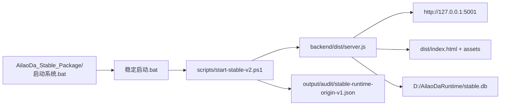
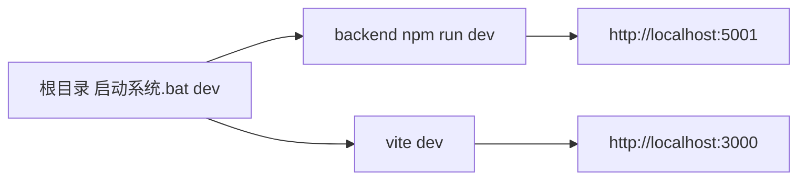

# 结构目录与运行链_2026-04-23

## 2026-04-23 主控复核最新口径

本文是当前维护入口。旧的 `结构目录与运行链_2026-04-22.md`、`代码目录结构-当前版.md` 和 `当前版本真实结构总图-当前版.md` 只作为历史参考；后续判断以本文和阶段 3 报告为准。

### 当前运行事实

| 项目 | 当前事实 |
| --- | --- |
| 唯一稳定访问入口 | `http://127.0.0.1:5001/` |
| 当前稳定包 | `F:\爱牢达\AilaoDa_Stable_Package` |
| 当前稳定包前端 | `F:\爱牢达\AilaoDa_Stable_Package\dist\index.html` |
| 当前稳定包后端 | `F:\爱牢达\AilaoDa_Stable_Package\backend\dist\server.js` |
| 当前运行数据库 | `D:\AilaoDaRuntime\stable.db` |
| 当前数据库状态 | `PRAGMA integrity_check = ok`，外键错误 0，Schema 漂移 0 |
| 当前运行模式 | `production` |
| 当前不是 | 不是智仔页面，不是 `3000` 开发口，不是根目录旧启动 |
| 当前本地壳 | BAT/PowerShell 稳定包壳；还不是安装器级 EXE |

### 最新主控验收

| 验收项 | 结果 |
| --- | --- |
| `npm --prefix backend run build` | PASS |
| `npx tsc --noEmit` | PASS |
| `npm run build` | PASS |
| `npm run audit:package:origin` | PASS |
| `npm run audit:permissions:role-assignment` | PASS |
| `npm run audit:permissions:assignment` | PASS |
| `npm run audit:permissions:system-ui` | PASS |
| `node scripts/orders-api-audit-v1.cjs` | PASS |
| `node scripts/sales-orders-browser-audit-v1.cjs` | PASS，14 steps，含创建、回款、历史回读截图 |
| `npm run verify:phase3` | PASS，46/46，failed 0，stuck 0，含 `stable-package-origin-final` |
| `npm run verify:phase3:package-browser` | PASS，49/49，failed 0，stuck 0 |
| `node scripts/full-codebase-audit-v1.cjs` | PASS |
| `git diff --check` | PASS；仅 LF/CRLF 工作区提示，无空白错误 |

### 2026-04-23 新增关键收口

| 收口点 | 当前处理 |
| --- | --- |
| 阶段 3 验收后 5001 不驻留 | 新增 `scripts/verify-phase3-package-browser.ps1`，验收前启动稳定包，验收后再次保证稳定包驻留 |
| 中文启动文件名误解码 | 包装器只引用 ASCII 路径 `AilaoDa_Stable_Package\scripts\start-stable-v2.ps1` |
| `team.write` 可能变相分配角色 | 新增防提权审计，角色分配必须具备 `authorization.roles.manage` |
| SQLite 索引缺行 | 已执行 `npm run repair:db:reindex`，修前备份，修后 `integrity_check = ok` |
| 阶段 3 闸门缺防提权链 | 新增 `role-assignment-escalation-chain`，现在阶段 3 为 49 项 |
| 销售订单 hook 过大 | 首拆已完成：新增 `pages/sales-orders/useSalesOrderWorkspaceData.ts`，下沉数据加载、详情回读、刷新和列表 upsert；`useSalesOrders.ts` 从 564 行降到 515 行 |
| 销售订单回款 hook | 二拆已完成：新增 `pages/sales-orders/useSalesOrderPayments.ts`，下沉收款弹窗、登记、核验；`useSalesOrders.ts` 从 515 行降到 469 行 |
| 销售订单动作 hook | 三拆已完成：新增 `pages/sales-orders/useSalesOrderActions.ts`，下沉佣金审核、订单状态、快速发货、手动结案；`useSalesOrders.ts` 从 469 行降到 431 行 |
| 销售订单草稿明细 hook | 四拆已完成：新增 `pages/sales-orders/useSalesOrderDraft.ts`，下沉草稿、表单状态、明细增删改、Excel 明细粘贴导入和金额汇总；`useSalesOrders.ts` 从 431 行降到 356 行 |
| 稳定包同步 | 已重新打包 `AilaoDa_Stable_Package`，旧包保留为 `AilaoDa_Stable_Package_previous_20260423_161053` |
| audit_logs 索引缺行复发 | 已执行 `npm run repair:db:reindex`，备份 `backup-2026-04-23T09-03-36-989Z.db`，修后阶段 3 包级验收 49/49 PASS |
| SQLite WAL 与优雅停机 | 已启用 `journal_mode=WAL`、`busy_timeout=5000`、本地 `shutdown.signal` 优雅停机；停止脚本 12 秒未退出才强制停止 |
| WAL 后备份恢复 | 备份前 checkpoint WAL，恢复前断开 Prisma，恢复后重建连接；备份指纹审计改为读取临时副本，避免污染 manifest |
| 角色分配策略服务化 | 新增 `backend/src/services/role-assignment-policy.service.ts`，集中用户 `segment` 默认规则、角色变更判断和 `authorization.roles.manage` 检查；`auth.controller.ts` 546 行降到 527 行，`team.controller.ts` 282 行降到 262 行 |
| 审计日志动态权限收口 | `backend/src/controllers/audit.controller.ts` 移除 `admin` 硬编码二次门禁，统一使用路由层 `audit.read`；新增 `audit-read-dynamic-permission-chain` 并接入阶段 3 |
| Casbin Fallback 严格权限收口 | `backend/src/permissions/casbinAuthorization.ts` 在生产模式默认禁用内置 RBAC 静默回退；新增 `audit:permissions:casbin-fallback`，并把预期失败探针日志隔离到 `output/audit/casbin-fallback-probe`，避免污染真实 `logs/error.log` |
| 认证 Token 存储服务化 | 新增 `backend/src/services/auth-token-store.service.ts`，`auth.controller.ts` 从 527 行降到 482 行；认证中间件不再反向导入控制器；新增 `auth-session-token-chain` 并接入阶段 3 |
| 认证审计与改密服务化 | 新增 `backend/src/services/auth-audit.service.ts` 和 `backend/src/services/auth-password.service.ts`；`auth.controller.ts` 从 482 行降到 437 行；新增 `auth-account-lifecycle-chain` 并接入阶段 3 |
| 阶段 3 包模式重启 | `scripts/phase3-readiness-audit-v1.cjs` 默认优先 `AilaoDa_Stable_Package\scripts\start-stable-v2.ps1`，并在最后追加 `stable-package-origin-final`，避免重启审计后回到根目录 |

### 当前源码规模

| 区域 | 目录数 | 文件数 | 说明 |
| --- | ---: | ---: | --- |
| `backend/src` | 18 | 167 | Express + Prisma 后端源码 |
| `pages` | 10 | 111 | 前端业务页面和页面级子模块 |
| `components` | 4 | 28 | 公共组件和 UI 底座 |
| `services` | 1 | 32 | 前端 API 客户端 |
| `app` | 0 | 5 | React 全局上下文 |
| `scripts` | 5 | 177 | 审计、启动、验收、打包、治理脚本 |
| `translations` | 1 | 10 | 中英越三语资源 |
| `utils` | 1 | 15 | 前端工具 |
| `public` | 0 | 3 | PWA/图标/静态资源 |

全仓审计口径：

| 指标 | 数值 |
| --- | ---: |
| active source files | 543 |
| active files | 547 |
| non-active / historical files | 12262 |
| route files | 23 |
| duplicate active source name groups | 0 |
| full-codebase findings | 0 |

### 当前根目录分层

```text
F:\爱牢达
├── app/                         # React 全局上下文
├── components/                  # 前端公共组件和 UI 底座
├── pages/                       # 业务页面和页面级子模块
├── services/                    # 前端 API 客户端
├── utils/                       # 前端工具
├── translations/                # 中英越三语资源
├── backend/                     # Express + Prisma + SQLite 后端
│   ├── src/                     # 后端源码
│   ├── prisma/                  # Prisma schema 与分域模型
│   └── dist/                    # 后端构建产物，不手改
├── scripts/                     # 启动、审计、验收、打包、治理脚本
├── public/                      # 静态资源
├── dist/                        # 前端构建产物，不手改
├── AilaoDa_Stable_Package/      # 当前稳定包
├── AilaoDa_Stable_Package_previous_* # 历史稳定包，只读归档，不作为验收入口
├── output/                      # 审计报告、截图、JSON 证据
├── logs/                        # 运行日志
├── backups/                     # 本地备份
├── uploads/                     # 上传附件
├── 历史归档/                    # 历史文件
├── 文档归档/                    # 历史文档
└── 爱劳达软件治理中心/          # 治理台账
```

### 当前后端结构

```text
backend/src
├── server.ts                    # 后端入口
├── config/                      # 运行时路径、数据库配置
├── constants/                   # 后端常量
├── controllers/                 # HTTP 控制器；已有部分子目录化
├── routes/                      # Express 路由
├── services/                    # 业务服务；订单、回款、采购、仓储、生产、货抵、备份等
├── database/                    # 运行库修复、审计、seed、迁移工具
├── middleware/                  # 认证、校验、限流等
├── permissions/                 # 权限注册表和 Casbin/DB 授权
├── validators/                  # 请求校验
├── types/                       # 后端类型
└── utils/                       # 后端工具
```

### 当前前端结构

```text
pages/
├── CRM.tsx + crm/               # 客户主数据、多名、多址、多联系人、客户池
├── SalesOrders.tsx + sales-orders/ # 销售订单、订单头、明细网格、回款入口
├── Procurement.tsx + procurement/  # 采购、供应商、收货联动
├── WarehouseWorkspace.tsx + warehouse/ # 仓库、库位、库存、流水、调拨
├── ProductionWorkspaceV2.tsx + production/ # 化工 BOM、工单、完工、防假完工
├── BarterWorkspaceView.tsx      # 货抵支付/换货贸易
├── ReceiptDiscrepancyWorkbench.tsx # 收发货差异
├── RMA.tsx                      # 售后/RMA
├── TeamManagement.tsx + team/   # 用户、角色、权限分配
└── finance/                     # 财务分析和应收调整面板
```

### 当前主逻辑链

| 主链 | 源头 | 写入/状态 | 下游影响 | 必跑验收 |
| --- | --- | --- | --- | --- |
| CRM 主数据 | `pages/CRM.tsx` / `customer.routes.ts` | 客户、多名、多址、多联系人、客户池 | 订单、回款、采购、AI 可见范围 | CRM 浏览器/权限审计 |
| 销售订单 | `SalesOrders.tsx` / `order.routes.ts` | 订单头、明细、客户名展平、状态 | 回款、发货、财务统计 | 订单 API、回款并发、浏览器链 |
| 回款/应收 | collections / receivable adjustment | 回款记录、核验、差异、调整 | 财务分析、风险、订单 paidAmount | `receivable-adjustment-*` |
| 采购/供应商 | `Procurement.tsx` / `procurement.routes.ts` | 供应商、采购单、部分收货 | 仓储入库、差异、RMA | `procurement-api-chain` |
| 仓储库存 | `WarehouseWorkspace.tsx` / `warehouse.routes.ts` | 仓库、库位、库存、流水、调拨 | 生产耗用、发货出库、台账 | `stock-ledger-reconcile`、warehouse audits |
| 生产 BOM | `ProductionWorkspaceV2.tsx` | BOM、原料耗用、完工入库 | 库存扣减、成本台账 | `chemical-bom-production-chain` |
| 发货/RMA | Shipping / RMA | 出库、回单、差异、退换 | 库存、售后、财务 | shipping + RMA browser chain |
| 货抵支付 | Barter | 分批抵扣、等值交换、并发一致性 | 回款口径、订单/客户余额 | barter concurrency |
| 权限治理 | Team/Role | 动态角色、权限点、数据范围 | 所有敏感接口 | role assignment + system UI |
| AI 隔离 | AI assistant/services | 按用户权限过滤 | 防止跨角色泄露 | `audit:ai:isolation` |
| 备份恢复 | backup service/scripts | 备份、恢复、指纹校验 | 本地两个月稳定和迁移 | backup restore + fingerprint |
| 运行停机 | `stop-runtime.ps1` / `start-stable-v2.ps1` | 本地 shutdown signal、HTTP server close、Prisma disconnect | runtime restart + phase3 package |

### 当前待拆分模块清单

这些不是立即要拆的结论，而是下一轮维护优先级。拆分前必须先跑对应闭环，拆分后必须由主控重跑阶段链。

| 优先级 | 文件 | 当前问题 | 建议拆分方向 |
| --- | --- | --- | --- |
| P1 | `pages/sales-orders/useSalesOrders.ts`，431 行 | 数据加载、回款、状态动作已拆；订单编辑、保存导入、OCR/离线扫描仍集中 | 继续拆 `useSalesOrderEditor`、`useSalesOrderImport`、`useSalesOrderOcrScan` |
| P1 | `backend/src/controllers/auth.controller.ts`，437 行 | 角色分配策略、Token 存储、认证审计和改密服务已抽出；登录、注册、刷新、登出 HTTP 编排仍集中 | 拆 auth session、registration |
| P1 | `backend/src/services/order-workspace.service.ts`，545 行 | 订单聚合读写和展示展平耦合 | 拆 order query、order mutation、order formatter |
| P1 | `backend/src/services/collection-state.service.ts`，546 行 | 回款状态规则集中且影响财务 | 拆状态机、金额计算、审计事件 |
| P1 | `backend/src/services/collection.service.ts`，535 行 | 回款查询、写入、核验交叉 | 继续沿 query/mutation/state 三层收口 |
| P1 | `backend/src/services/finance-summary.service.ts`，534 行 | 报表聚合逻辑较大 | 拆销售、回款、库存、货抵聚合视图 |
| P2 | `backend/src/services/backup.service.ts`，533 行 | 备份、保留策略、恢复逻辑集中 | 拆 backup create、retention、restore、fingerprint |
| P2 | `backend/src/services/barter.service.ts`，531 行 | 货抵协议、分批抵扣、并发状态集中 | 拆 barter agreement、settlement ledger、state policy |
| P2 | `backend/src/services/production-mutation.service.ts`，529 行 | BOM/工单/完工写入集中 | 拆 BOM mutation、work order mutation、completion policy |
| P2 | `pages/ProductionWorkspaceV2.tsx`，529 行 | 页面容器仍偏大 | 继续下沉 tab/section orchestration |
| P2 | `pages/production/ProductionBomLineGrid.tsx`，495 行 | 化工 BOM 网格复杂度高 | 拆 paste parser、row validator、material selector |
| P2 | `pages/team/RoleManagementPanel.tsx`，496 行 | 权限矩阵 UI 复杂 | 拆 role list、permission matrix、role editor |

### 当前不应拆的边界

| 对象 | 原因 |
| --- | --- |
| `AilaoDa_Stable_Package_previous_*` | 暂不删除，作为历史回滚包；只做归档标记 |
| `backend/prisma/*.db` 影子库 | 暂不删除，先保持 `runtime-db-integrity` P2 提醒，后续做隔离说明 |
| `components/ui/*` | UI 底座刚建立，现阶段应稳定复用，不应频繁换皮 |
| `scripts/phase3-readiness-audit-v1.cjs` | 是主控验收闸门，优先保证稳定，不做大改 |
| `scripts/start-stable-v2.ps1` | 是稳定包启动核心，任何改动必须跑 package origin + phase3 |

### 当前证据文件

| 证据 | 路径 |
| --- | --- |
| 阶段 3 主报告 | `F:\爱牢达\output\audit\phase3-readiness-audit-v1.json` |
| 稳定包来源 | `F:\爱牢达\output\audit\stable-package-origin-audit-v1.json` |
| 全仓审计 | `F:\爱牢达\output\audit\full-codebase-audit-v1.json` |
| 活跃源码清单 | `F:\爱牢达\output\audit\active-source-inventory-v1.json` |
| 数据库完整性 | `F:\爱牢达\output\audit\runtime-db-integrity-audit-v1.json` |
| REINDEX 修复 | `F:\爱牢达\output\audit\runtime-db-reindex-repair-v1.json` |
| 防角色提权 | `F:\爱牢达\output\playwright\role-assignment-escalation-audit-report-v1.json` |
| Casbin fallback 严格权限 | `F:\爱牢达\output\audit\casbin-fallback-policy-audit-v1.json` |
| 认证会话 Token 链 | `F:\爱牢达\output\playwright\auth-session-token-api-audit-report-v1.json` |
| 认证账号生命周期链 | `F:\爱牢达\output\playwright\auth-account-lifecycle-api-audit-report-v1.json` |
| 系统角色 UI 授权 | `F:\爱牢达\output\playwright\role-system-permission-ui-browser-audit-report-v1.json` |
| 销售订单 API | `F:\爱牢达\output\playwright\orders-api-audit-report-v1.json` |
| 销售订单浏览器 | `F:\爱牢达\output\playwright\sales-orders-audit-report-v1.json` |
| WAL 与优雅停机收口 | `F:\爱牢达\爱劳达软件治理中心\10_主线任务\阶段3数据库WAL与优雅停机收口_2026-04-23.md` |
| 备份恢复 API | `F:\爱牢达\output\playwright\backup-restore-api-audit-report-v1.json` |
| 备份恢复指纹 | `F:\爱牢达\output\audit\backup-restore-data-fingerprint-audit-v1.json` |
| 写入-备份-恢复-回读 | `F:\爱牢达\output\audit\runtime-write-backup-restore-readback-audit-v1.json` |

## 当前结论

当前项目已经从“开发目录可跑”推进到“稳定包可启动、可验收”的阶段。

本轮确认的稳定运行入口：

- 本地稳定壳：`AilaoDa_Stable_Package\启动系统.bat`
- 稳定 URL：`http://127.0.0.1:5001`
- 运行数据库：`D:\AilaoDaRuntime\stable.db`
- 当前形态：稳定包 + BAT/PowerShell 启动链
- 当前还不是：Electron/Tauri/安装器级 EXE

## 根目录结构

| 路径 | 定位 | 维护原则 |
| --- | --- | --- |
| `App.tsx` / `index.tsx` / `index.html` | 前端入口 | 只做入口挂载，不承载业务逻辑 |
| `pages/` | 业务页面层 | CRM、订单、采购、仓储、生产、发货、回款、货抵、RMA 等页面 |
| `components/` | 通用组件层 | UI shell、表格、状态徽章、导航、通用控件 |
| `services/` | 前端 API 服务层 | 统一请求后端，不直接写业务规则 |
| `utils/` | 前端工具层 | 纯工具函数、格式化、名称兜底 |
| `translations/` | 多语言资源 | 中/英/越文本集中治理 |
| `backend/src/` | 后端源码 | 控制器、路由、服务、权限、数据库和业务闭环 |
| `backend/prisma/` | Prisma schema 与迁移相关资源 | 数据结构源头，不存放运行库 |
| `scripts/` | 审计、打包、启动、修复、验证脚本 | 只保留受治理脚本；长运行必须有 5 分钟上限 |
| `dist/` | 前端构建产物 | 生成物，不手改 |
| `backend/dist/` | 后端构建产物 | 生成物，不手改 |
| `AilaoDa_Stable_Package/` | 当前本地稳定包 | 用户优先打开这里的启动壳 |
| `AilaoDa_Stable_Package_previous_*` | 历史稳定包 | 只保留，不直接运行验收 |
| `output/` | 审计报告与截图证据 | 证据输出，不作为源码入口 |
| `logs/` / `backups/` / `uploads/` | 运行副产物 | 不手删，先审计再归档 |
| `爱劳达软件治理中心/` | 治理台账 | 记录结构、运行链、验证证据和风险 |
| `历史归档/` / `文档归档/` / `测试/` | 历史资料 | 默认只读，不参与当前运行 |

## 稳定包运行链



关键规则：

- 稳定包壳只打开 `http://127.0.0.1:5001`
- 包内启动壳不再显示开发端口
- 稳定包启动后必须写 `stable-runtime-origin-v1.json`
- `audit:package:origin` 必须证明当前 5001 来自 `AilaoDa_Stable_Package`
- 运行库必须在 `D:\AilaoDaRuntime\stable.db`，不能回到 `backend/prisma` 旧库

## 开发运行链

开发链仅用于调试，不作为稳定验收：



判断原则：

- 讨论“能不能本地跑两个月”时，只看稳定包链
- 讨论“前端开发调试”时，才看 3000
- 3000 不是阶段 3 稳定验收入口

## 当前模块逻辑链

| 主链 | 当前闭环 | 证据来源 |
| --- | --- | --- |
| CRM 客户主数据 | 多名、多址、多联系人、客户池、权限范围 | 客户/权限/浏览器审计 |
| 销售订单与回款 | 订单、客户名回读、回款核验、金额状态 | `receivable-adjustment-api-chain`、回款浏览器链 |
| 采购与供应商 | 供应商、采购订单、部分收货、仓储联动 | `procurement-api-chain`、采购仓储人工流 |
| 仓储库存 | 仓库、库位、库存台账、出入库关联 | `stock-ledger-reconcile`、仓储页面审计 |
| 生产 BOM | 化工 BOM、原料耗用、完工入库、防假完工 | `chemical-bom-production-chain` |
| 发货与 RMA | 发货、回单、差异、RMA 入口联动 | `shipping-api-chain`、发货浏览器链 |
| 货抵支付/换货贸易 | 货值标的、分批抵扣、并发一致性 | `barter-concurrency` 与货抵相关审计 |
| AI 与权限隔离 | 权限内查询、敏感数据隔离、AI 回归 | `ai-security-regression` |
| 备份恢复 | 备份清单、指纹、恢复读回、report-only 保留策略 | `backup-restore-*`、`audit:backup-retention` |

## 全量扫描证据

本轮已执行：

- `npm --prefix backend run build`
- `npx tsc --noEmit`
- `npm run build`
- `npm run audit:package:freshness`
- `npm run audit:package:origin`
- `npm run audit:entrypoints`
- `npm run audit:backup-retention`
- `npm run audit:deployment:readiness`
- `node .\scripts\full-codebase-audit-v1.cjs`
- `npm run audit:phase3:soak:package`
- `npm run verify:phase3:package-browser`

结果摘要：

- 后端编译：PASS
- 前端 TypeScript：PASS
- 前端构建：PASS
- 稳定包新鲜度：PASS
- 稳定包来源：PASS
- 启动入口：PASS
- 备份保留治理：PASS
- 部署迁移准备：PASS
- 全仓扫描：PASS
- package-mode soak：7/7 PASS
- package-browser：49/49 PASS

全仓扫描结果：

- 有效源码文件：540
- 超大文件：0
- 后端路由文件：23
- 有效源码重复文件名组：0
- 历史命名文件：已纳入治理
- 当前 finding：0

## 不能误判的边界

已经能证明：

- 当前稳定包可以启动
- 当前 5001 来自稳定包
- 当前包内壳没有开发端口残留
- 当前备份策略默认 report-only，不会因为保留策略自动删除旧备份
- 当前全仓扫描没有 P0/P1 finding

不能宣称：

- 不能宣称已经完成真正 EXE
- 不能宣称已经真实连续运行两个月
- 不能宣称已经达到 Odoo/ERPNext/SAP Business One 的完整成熟度
- 不能用一次 package-browser PASS 代替长期真实业务使用

## 后续维护规则

1. 改业务代码后必须重新跑对应 API 闭环。
2. 改页面后必须重新跑对应浏览器审计。
3. 改启动、打包、环境变量后必须重新跑 `audit:package:freshness` 和 `audit:package:origin`。
4. 改数据库、备份、迁移后必须重新跑备份恢复和数据库完整性链。
5. 宣称“稳定可用”前必须跑 `verify:phase3:package-browser`。
6. 所有超过 5 分钟的命令必须判定卡住，不继续等待。

## 2026-04-23 证据矩阵补充

本轮新增两个治理入口，专门解决“后端绿但浏览器证据不足”和“测试数据不能盲删”的问题。

| 文件 | 用途 |
| --- | --- |
| `爱劳达软件治理中心/10_主线任务/阶段3系统可用性总表与证据矩阵_2026-04-23.md` | 按模块列出 API、浏览器、数据一致性、稳定包和备份恢复证据，明确哪些已证明、哪些不能过度宣称 |
| `爱劳达软件治理中心/10_主线任务/阶段3浏览器点测缺口与测试数据保洁策略_2026-04-23.md` | 固化下一轮浏览器逐页验收顺序、截图证据要求、测试数据前缀和 report-only 保洁规则 |

当前判断保持不变：稳定包和后端主链证据较强，但全量浏览器逐页点测仍是阶段 3 最大缺口。
