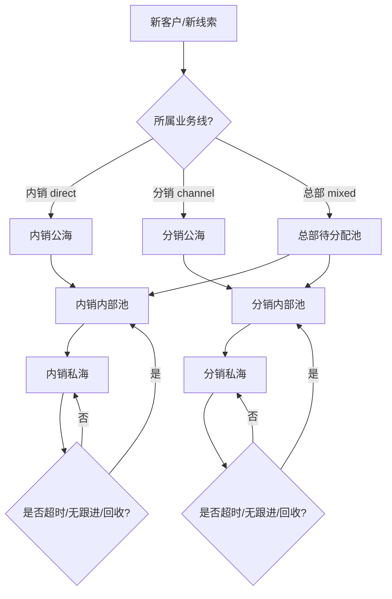

# CRM客户池流转图（当前版）

## 目标

把客户从“哪一类业务、属于哪个池、归谁负责、什么时候回收”这四件事画清楚。

## 适用前提

当前系统已经存在这些基础：

- 内销 / 分销业务线概念：`direct` / `channel`
- 管理层视角：`mixed`
- 客户归属字段：`salespersonId`
- CRM 页面上的公海 / 我的客户视图概念

所以这份流转图不是从零设计，而是把现有雏形补成正式治理流。

## 流转总图

## 分层解释

### 1. 新客户/新线索

来源可以是：

- 手工录入
- 批量导入
- 外部同步
- 营销/活动导入

默认不直接进私海，先进入对应业务线的公海或待分配池。

### 2. 公海

公海是共享筛选池，不是“没人管”。

建议作用：

- 接收新客户
- 接收不明确归属客户
- 接收回收后的待重新分配客户

### 3. 内部池

内部池可以理解成“团队池 / 业务线池”。

它比公海更近一步，适合：

- 经理筛选
- 团队预分配
- 系统按规则自动分发到销售

### 4. 私海

私海是明确责任客户。

进入私海后：

- 跟进责任到个人
- 经理可看
- 销售负责日常动作

## 关键流转动作

### 公海 -> 内部池

适合：

- 经理筛选
- 系统按规则分流
- 将不明确客户归到某业务线待分配池

### 内部池 -> 私海

适合：

- 经理派发
- 销售领取
- 自动负载均衡分配

### 私海 -> 内部池

适合：

- 销售离职/转岗
- 长期未跟进
- 经理回收
- SLA 超时回收

### 内部池 -> 公海

适合：

- 归类错误
- 业务线不匹配
- 重新进入共享筛选池

## 建议留痕字段

- `businessLine`
- `poolType`
- `ownerType`
- `ownerId`
- `ownerTeamId`
- `assignedAt`
- `assignedBy`
- `claimedAt`
- `claimedBy`
- `reclaimedAt`
- `reclaimedBy`
- `assignmentReason`
- `reclaimReason`

## 结论

这套流转图说明了一件事：

**客户池不是一张列表，而是一个有业务线、有责任人、有回收规则的状态机。**
